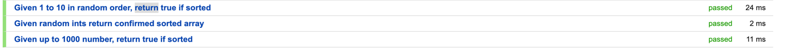
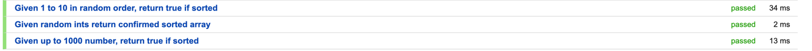
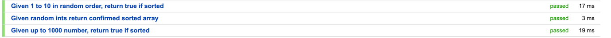

# Sorting Algorithms

## Bubble Sort

### How I implemented this

I used https://en.wikipedia.org/wiki/Bubble_sort#Pseudocode_implementation and implemented this in the BubbleSort.java

1. As the input was an Array of Integers, I created this field privately. 
This is with knowing the field will remain encapsulated if I use getters and setters in the future. Should this be required.

1. I then created a constructor using the private field created previously.

1. Following the wikipedia link I implemented the algorithm in a Java function.

### Explaning the algorithm

```java
public int[] sort(){
//        set a boolean to check if anything changed.
        boolean check = false;
//        loop array and replace the ints if the previous value is more than the current iteration
        for (int i = 1; i <= this.arrayOfInts.length-1; i++) {
            if (this.arrayOfInts[i-1] > this.arrayOfInts[i]){
                check = true;

                int val1 = this.arrayOfInts[i-1];
                int val2 = this.arrayOfInts[i];

                this.arrayOfInts[i-1] = val2;
                this.arrayOfInts[i] = val1;
            }
        }
        if (check){
            this.sort();
        }
        return this.arrayOfInts;
    }
```

A boolean check is set to false so that when the number previous the current number in the loop used, the boolean can be set to true.

A for loop iterates over the array of integers, starting at 1 so the first two numbers can be checked as per the algorithm on wikipedia. This is so that all numbers are checked. The for loop is the size of the array of integers -1.

The if checks if the previous number in the array is larger than the current one. If the previous number is larger then set the boolean to true and perform the swap of numbers.

The swap of number uses the array of integers that is sorted in the class. 
Two temporary variables are used to ensure the correct values are used, for the current and previous values. 
If this is not done you may end up with repeating numbers along with missing numbers.
The two temporary variables are the used to replace the current and previous numbers in the array.

if the boolean check is true, this means that a number had to be swapped, the function needs re running to ensure the numbers are sorted.
The function is called recursively every time the check remains true.

Once the check is false the array of integers is returned sorted

### Explaining the Testing

I hard coded 4 numbers that I could sort myself manually in order and hard coded the expected result. The same was done for 1 to 10.

I then randomly generated over 100 numbers and used Javas Array sort to get the expected result. 


# Merging 2 sorted Integers

I started by providing the two int[] as inputs, as well as the BubbleSorter by using method overloading on the constructor.

```java
    public SorterMerger(int[] input1, int[] input2) {
        this.input1 = input1;
        this.input2 = input2;
    }
    public SorterMerger(BubbleSort input1, BubbleSort input2) {
        this.input1 = input1.getArrayOfInts();
        this.input2 = input2.getArrayOfInts();
    }

```

The merge function calls another function isInput1LargerThan2 which returns true if the first array item is larger than the first in input2. This is as the arrays are already sorted.

Depending on which array has the smallest [0] value, dicates which input take temp1, the other input will be stored in temp2 variable, 

An array of int is initialised by adding the size of the two inputs and a counter variiable is begun at 0. 

The counter keeps track of the array index of the result variable so the 2nd array follows on from the first array when adding elements.

First temp1 is run in a loop and the results added then temp2

### Testing
First I tested both arrays merged and returned as one.
I then tested that the array would return correctly if the parameter values were provided in the opposite way to previously.
A length check was performed on the function to ensure the counter is working correctly.

## Final notes
- Test coverages is 
  - Class 100%
  - Method 80%
  - Loine 88%

## Recommendations

- Creating a Interface for CanSort
- implement the interface to BubbleSort and subsequent sub classes
- Change the SorterMerger to accept one of the sorters (e.g bubble) that CanSort via the constructor as a 3rd parameter. Not optional to prevent NullPointException
- run the sort method at the end of the SorterMerger.merge() to sort the resulting array

Or

- Make SorterMerger abstract parent class
- change the SorterMerger.merge() as static method or create a 2nd function that calls the merge() that is static and takes two int[] parameters - in order avoid using new keyword
- on the two Parameter contsructor of a Sorting class run the sorting method from the SorterMerger and store the result as if it was a single int[]
- Extend BubbleSorter and subsequent sorters to SorterMerger 

## Optimisation

Ran 3 tests to check time





### Test
- Given 1 to 10
  - I used this test as it was the most consistent data on each run
    - Average time 25ms 
      - (24ms + 34ms + 17ms) = 75 / 3 = 25ms
    
- One optimisation could be to only have one temporary variable val1
- One of the best thing I could do is use multiple threads